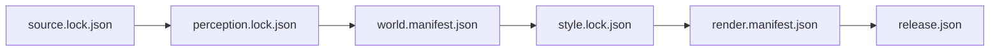

# Isometric Stanford architecture

This document records implemented truth. Planned production behavior remains in
GitHub issues and mdBook design chapters until code makes it current.

## Implemented bootstrap

The Rust workspace contains six safe-Rust crates with a one-way dependency
graph. `isometric-core` owns validated IDs, integer world coordinates, fixed
screen coordinates, and palette indexes. `isometric-world` owns a sorted,
immutable semantic object list whose class enum intentionally has no transient
people or vehicle variants. `isometric-style` owns the bounded indexed palette
and projection scales. `isometric-render` owns the deterministic CPU reference
projection and bootstrap raster. `isometric-validate` owns fail-closed semantic
and style checks. `isometric-cli` exposes the complete planned command names,
executes reference rendering and validation, and rejects unfinished commands.

```mermaid
flowchart LR
    source["Approved source records"]
    perception["Pinned perception artifacts"]
    world["isometric-world\nimmutable semantic objects"]
    style["isometric-style\noriginal procedural rules"]
    render["isometric-render\nfixed-point CPU"]
    validate["isometric-validate\nfail-closed gates"]
    publish["DZI/WebP publisher\nnot implemented"]
    web["OpenSeadragon viewer shell"]

    source -. "future compiler" .-> perception
    perception -. "future fusion" .-> world
    world --> render
    style --> render
    world --> validate
    style --> validate
    render -. "future guarded tiles" .-> publish
    publish -. "static release" .-> web
```

The current renderer is an original deterministic reference grammar of
world-anchored diamonds and columns. It proves fixed-point 2:1 projection,
stable-ID variation, bounded indexed images, palette-only output, and byte
repeatability. It is not the production triangle rasterizer, depth buffer,
guarded-supertile renderer, landmark system, or qualified art style.

The CLI currently implements `validate semantic`, `validate render`, and
`render region`. All other documented command names fail with an explicit
not-implemented error. This prevents scaffolding from being mistaken for a
working ingestion or publication pipeline.

The web workspace implements a responsive, accessible viewer shell. It creates
an OpenSeadragon instance only when a DZI URL is configured, keeps browser
image smoothing disabled, and reports missing release configuration. No DZI
release is committed or published.

## Binding invariants

1. World coordinates are signed integer millimeters relative to a versioned
   local origin. Canonical rasterization does not depend on floating point.
2. Object ID zero is reserved. Objects are rendered in stable ID order until a
   depth-sorted production scene contract replaces this bootstrap order.
3. Style palettes contain 1 to 128 colors. Every saved pixel is a palette
   index before encoding.
4. Output dimensions are non-zero and at most 16,384 pixels per image.
5. Projection arithmetic checks overflow and fails without partial output.
6. Final renderable semantic types cannot express people or vehicles.
7. Unknown semantic objects fail qualification instead of becoming invented
   geometry.
8. External artifacts are content-addressed and referenced through manifests,
   never silently vendored into Git.
9. Canonical exact hashes are Linux CPU evidence. Cross-platform comparisons
   use semantic IDs and approved palette-index tolerances.
10. Release publication is unavailable until source, perception, world, style,
    render, and release manifests form a complete verified chain.

## Durable artifact chain



Bootstrap manifests deliberately describe an unqualified state. The manifest
validator rejects malformed hashes, wrong slice bounds, unknown schema
versions, and a release marked published before qualification.

## Not implemented

- Network source retrieval and object storage
- OSM, Overture, Microsoft, NAIP, or LiDAR ingestion
- Perception model execution and correction workflow
- Source fusion, confidence, dirty-region propagation, and unknown accounting
- Production triangle rasterization, depth, occlusion, shadows, outlines,
  dithering, guarded supertiles, and seam oracle
- Landmark and vegetation grammar
- DZI/WebP publication
- Review dashboard, full visual metrics, and fixed-device qualification
- H100 perception benchmark and full vertical-slice render

Those boundaries are tracked as GitHub Research, Decision, Requirement, and
Task issues. Documentation may explain the intended design but must not claim
it is implemented.
