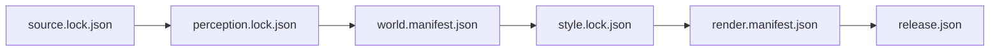

# Isometric Stanford architecture

This document records implemented truth. Planned production behavior remains in
GitHub issues and mdBook design chapters until code makes it current.

## Implemented bootstrap

The Rust workspace contains eleven safe-Rust crates with a one-way dependency
graph. `isometric-source` validates the approved source lock and synchronizes
content-addressed artifacts through a bounded-memory cache. HTTPS acquisition
uses three bounded attempts for classified transient failures. It continues
partial bytes only when the lock pins an entity tag and the server returns the
exact `206` range, then verifies the complete length and digest before an atomic
promotion. Scheduled assurance restores only a cache whose key includes the
complete `source.lock.json` digest. The exact 7.2 MB public-domain NAIP hero
crop is a committed source fixture because its federal export service rejects
GitHub-hosted runner connections; the approximately 440 MB LiDAR bundle remains
external and content-addressed.
`isometric-reference` owns the registered reference-manifest schema and
fail-closed bundle validation. It requires one orthographic camera, guarded
pixel grid, lighting contract, and exact color, whitebox, linear-depth,
view-normal, fixed-shadow, and coverage records. It streams SHA-256 validation
through a bounded buffer, verifies PNG and depth headers, rejects unsafe paths,
and enforces the pilot coverage gate before downstream processing. The same
crate compares bounded exact raw archives from independent and monolithic
captures, performs a stable two-pixel registration search, separates source,
lighting, and monolithic gates, classifies failures, and emits hash-identified
PNG review evidence without retaining a complete campus raster.
The `capture/` TypeScript workspace owns the noncanonical browser boundary. It
uses pinned Three.js, 3d-tiles-renderer, and a direct Chromium headless shell to
hold one orthographic camera while producing color, neutral whitebox, linear
depth, view-normal, fixed-shadow, and coverage passes. A stable-readiness state
machine requires a loaded root tileset, no active load, no load error, a
minimum visible-tile count, and an unchanged content signature for both a
frame count and wall duration. A small raw Chrome DevTools Protocol connection
creates and navigates the page without retaining a Playwright browser session.

A one-time tokenized loopback coordinator injects credentials into page memory
after navigation. The browser installs its Google request ceiling before scene
creation. Each raw pass streams to a separate credential-free ingest worker,
which stages it privately, invokes the bounded safe-Rust PNG encoder, generates
exact crops, and writes the manifest. The Rust reference validator must accept
the complete version-two bundle before an atomic rename makes it visible to
later stages. Credentials are absent from child environments, commands,
artifacts, manifests, URLs, validator subprocesses, and sanitized diagnostics.
The built browser client is served by an allowlisted loopback static server,
not a development server. The bounded Hoover probe installs its request ceiling
before navigation, reuses one Google root tileset while reframing three camera
orientations, records URL-free network, renderer, and process-separated memory
telemetry, and writes private visual and exact crop-join evidence. The pinned
baseline camera is 330 degrees azimuth, 42 degrees elevation, and 250
millimeters per source pixel. The camera probe used a 64 MiB retention target
and 96 MiB ceiling. The independent-overlap path supersedes that older setting
with a 128 MiB retention target and 256 MiB ceiling. The measured worker envelopes are 1 GiB for
1,280-pixel grids and 1.25 GiB for 2,560-pixel grids. Host-memory policy
reserves at least 2 GiB and 25 percent, caps acquisition at four workers, and
returns zero when no worker fits. The current crop join proves cells inside one
guarded supertile. Independent Hoover cores now reuse one fixed camera world
matrix and move through off-axis orthographic frusta derived from one local
metric grid. Their 64-pixel saved source seam passes bounded color, coverage,
depth, and normal gates. A separately traversed monolithic source oracle and
the captured-lighting layers still fail, so issue #167 remains open.
`isometric-perception` decodes the locked NAIP GeoTIFF, streams locked LAZ
points through a bounded buffer, transforms audited source coordinates, masks
vector-owned cells, and emits frozen semantic evidence with no source pixels or
transient classes. `isometric-core`
owns validated IDs, integer world coordinates, fixed
screen coordinates, and palette indexes. `isometric-world` owns an immutable,
spatially partitioned polygonal world with holes, building parts, heights,
roofs, materials, confidence, provenance, reviewed overrides, fixed
EPSG:26910 origin, and conservative screen bounds. Its class enum intentionally
has no transient people or vehicle variants. `isometric-style` owns the bounded
indexed palette, projection scales, and versioned ordinary-scene grammar.
`isometric-mask` owns the 24-class registered pixel ontology, fixed-width mask
encoding, reference hash chain, evidence flags, instance consistency, and
bounded streaming validator. Evidence and repair-input artifacts may retain
transient and source-artifact classes. Persistent artifacts reject those
classes structurally. Its production registration constructor derives both
the parent-manifest and grid-camera digests from the canonical reference
manifest. The same crate owns bounded integer geometry kernels for Scharr
depth gradients, encoded-normal discontinuity, stable hysteresis, square
morphology, row-major connected components, 3-4 chamfer distance,
marker-controlled watershed, and quantized line evidence. Finite-radius
kernels may operate on guarded cells whose guard covers their complete
dependency radius. Connectivity and flood kernels operate once on the full
registered supertile before any 512-pixel cell is sliced. `isometric-render`
owns the deterministic CPU comparison
projection, procedural grammar, and bounded fixed-point triangle and
integer-depth raster core. The planned `isometric-stylize` crate will consume
validated reference and mask bundles without changing the DZI delivery
boundary.
`isometric-publish` owns lossless WebP encoding, canonical indexed pyramid
tiles, complete artifact validation, and atomic DZI assembly.
`isometric-validate` owns fail-closed semantic and style checks.
`isometric-cli` exposes the complete planned command names, verifies reference
and mask artifacts, and
compiles the fused hero world, executes reference rendering and validation, and
rejects unfinished commands.

```mermaid
flowchart LR
    source["isometric-source\napproved content cache"]
    reference["isometric-reference\nregistered layer contract"]
    perception["Pinned perception artifacts"]
    world["isometric-world\nimmutable semantic objects"]
    style["isometric-style\noriginal procedural rules"]
    render["isometric-render\nfixed-point CPU"]
    validate["isometric-validate\nfail-closed gates"]
    publish["isometric-publish\nlossless WebP DZI"]
    web["OpenSeadragon viewer shell"]

    reference -->|"validated multipass bundle"| perception
    source -->|"locked NAIP + LiDAR"| perception
    source -->|"locked OSM + Overture"| world
    perception -->|"frozen 20 m evidence"| world
    world --> render
    style --> render
    world --> validate
    style --> validate
    render -->|"guarded indexed tiles"| publish
    publish -->|"static candidate"| web
```

The original reference grammar still renders world-anchored diamonds and
columns. The production raster core now accepts one canonical triangle batch,
sorts it by stable primitive key, clips work to the bounded viewport, applies a
half-open shared-edge rule at fixed pixel centers, interpolates integer depth,
and writes palette indices only when depth is closer. Equal-depth fragments
retain the lower stable key without an owner buffer. Each active raster surface
owns exactly one palette byte and one 32-bit depth value per pixel.

The ordinary scene compiler converts every canonical polygon and hole into
deterministic horizontal trapezoids, then triangles. It renders ground,
hardscape, roads, paths, empty parking, athletic surfaces, water, mapped
vegetation footprints, and ordinary building extrusions. A world-anchored grid
places stable, jittered, faceted tree crowns only inside mapped vegetation.
Buildings and crowns cast a separate hard-shadow mask that is composited onto
eligible surfaces. A bounded post-process adds sparse world-anchored material
patterns and one-pixel building and canopy outlines. Flat roof faces and two
directional facade ramps complete the ordinary-scene layer. A separate
landmark module replaces three source extrusions with original parameterized
geometry: a stepped and windowed Hoover Tower, a gabled Memorial Church with
repeated openings, and a reviewed low Main Quad mass with repeated courtyard
arcade openings.

The renderer derives a stable full-scene coordinate layout without allocating
its framebuffer. Each canonical tile selects objects through conservative
projected bounds, renders into a style-derived guard, applies every ordinary
and landmark pass in world coordinates, then crops its saved pixels. The seam
oracle reconstructs the full hero from independently rendered tiles and
requires byte equality with the monolithic reference. The 250 millimeter scale
probe renders the approximately 8K layout through the same bounded API. The
publisher encodes each palette tile as lossless RGB WebP, derives lower levels
from canonical indexed parents, records a complete hash chain, and atomically
promotes the staged pyramid. Survey-derived roof geometry and the qualified art
style remain unfinished layers.

The CLI currently implements `source sync`, `reference inspect`, `mask inspect`, `perceive run`, `world compile`,
`world inspect`, `validate semantic`, `validate render`, `validate release`,
`render region`, `publish dzi`, `style candidate-a`, `style candidate-b`, and
`style candidate-c`. Source synchronization rejects unapproved, mis-hashed,
insecure records before use. Dynamic Google reference capture remains separate
from the generic immutable source synchronizer. The capture workspace contains
a pinned Hoover request at `capture/specs/hoover-pilot.json` and the measured
camera probe at `capture/specs/hoover-camera-probe.json`; running either
requires an explicit local credential and never occurs in ordinary CI.
Mask inspection reads a manifest capped at 1 MiB, streams one fixed-width
eight-byte record per pixel through a 64 KiB buffer, and retains only 24 class
counts plus a bounded 262,145-entry instance-class table. A mask may be at most
4,096 pixels per side, and validation memory does not grow with its byte size.
Perception decodes exact
four-band NAIP,
streams four serial LAZ sources in 250,000-point chunks, discards unclassified
low elevated returns from persistent evidence, and freezes 372 eligible cells.
Hero compilation projects WGS84 vector geometry into
EPSG:26910, subtracts the fixed origin, rounds to local integer millimeters,
derives stable content IDs, normalizes buildings and buffered road segments,
and fuses the frozen evidence into uncovered 20 meter cells. DZI publication
requires the compiled world, writes only to a new output path, and validates
every descriptor, canonical tile, WebP tile, palette color, and manifest hash.
The style command reconstructs the 7,623 by 3,325 indexed master from bounded
guarded tiles, crops four stable review scenes, renders isolated landmark masks,
and writes lossless WebP, HTML, metrics, and known deviations through an atomic
staging directory. The review assembly holds one 25 MB indexed master for
contact-sheet work; canonical tile workers remain bounded independently of map
area. All other documented command names fail with an explicit not-implemented
error.

`publish dzi` keeps the locked base style as its default and accepts the
explicit selector `candidate-c` for inspectable, unapproved preview pyramids.
Every generated release manifest records the exact style ID and style-file
digest. Release validation fails closed unless both the palette bytes and style
identity match a known implementation. Scheduled assurance, the release dry
run, and the real-pyramid browser suite use Candidate C explicitly without
changing `style.lock.json` or representing the candidate as approved.

Candidate B extends the ordinary grammar without changing the raster boundary.
Eligible walls receive repeated depth-safe window and door quads. Convex simple
footprints receive bounded hip-roof planes, while complex footprints fail back
to the deterministic flat fill. Each object is capped at 512 facade quads and
32 hip-roof planes before fallback. Parking markings and material variation are
anchored in absolute projected coordinates. Four-tone tree crowns remain
seeded by stable object IDs. Conservative roof bounds participate in spatial
tile selection, and Candidate B guarded tiles must reconstruct the monolithic
scene exactly.

Candidate C is the final bounded style stage on the same raster architecture.
It adds diagonal roof-tile accents in absolute projected coordinates so both
hip and complex planar roofs receive seamless treatment. Stable object IDs
select facade omissions, glazing tones, lintels, and door positions without
runtime randomness. Hero openings use the Candidate C material ramp, while
road and path accents use sparse world-anchored dash cadence. The monotonic
detail-level enum prevents incompatible boolean combinations and keeps earlier
candidate constructors byte-stable.

The fused world contains 2,820 objects in 72 partitions. Five dominant unmapped
building-evidence cells remain explicit unknowns, giving 5,202 ppm unknown
coverage. The manifest pins all seven source hashes and the perception artifact
hash with no deferred prototype source. OSM construction features are omitted,
unclassified low elevated LiDAR returns cannot become persistent classes, and
neither the schema nor the compiler can emit people or vehicles.

The web workspace implements a responsive, accessible viewer shell. It creates
an OpenSeadragon instance only when a DZI URL is configured, keeps browser
image smoothing disabled, bounds decoded-tile counts from an explicit memory
policy, starts phone-width screens at a legible zoom, and reports missing
release configuration. The viewer uses the Canvas drawer, keeps keyboard and
touch navigation enabled, retries failed tiles twice, exposes recoverable
descriptor and tile failures, and redraws after a context restoration event.
Ordinary CI exercises a routed lossless DZI fixture on desktop and mobile;
scheduled assurance repeats the same checks against the complete generated
Candidate C hero pyramid. The release dry run builds the viewer separately from
the art and then passes both through `scripts/assemble_preview.py`. The
assembler verifies the current world hash, release state, exact style, DZI
descriptor, every WebP hash and byte count, and the absence of pre-staged art
before it atomically creates an explicitly unqualified preview. This prevents
an ignored stale `web/public/art` directory from being mistaken for current
evidence. For the exact Candidate C world, style, and image dimensions, the
viewer exposes stable `#view=` review states for the whole campus, Hoover Tower,
Memorial Church, and the Main Quad. Named views use fixed image-space crops,
support browser history, and fail closed to the whole-campus view when release
identity changes. Scheduled assurance captures each landmark at desktop and
mobile sizes against the real pyramid. A locally generated candidate has been
exercised in the assembled viewer, but no DZI release is committed or
published.

The separately routed `/review` workbench consumes one immutable registered
reference manifest. Its bounded reader fetches the manifest and six layers in
canonical order, enforces per-file and aggregate byte ceilings, rejects
redirects, verifies SHA-256 and portable headers, and exposes no viewport until
the complete bundle passes. Only the two selected layers receive browser image
decodes. Linear integer depth is converted to a deterministic inspection-only
grayscale preview. Split and wipe views share one source-pixel pan and zoom
state, include keyboard and 1:1 controls, and expose bundle identity, camera,
lighting, attribution, coverage, and hashes. A development-only Vite endpoint
serves exactly seven allowlisted files from `REFERENCE_BUNDLE_DIRECTORY`; it is
absent from production builds and never stages raw reference content for
publication.

The `/review/overlap` workbench consumes one immutable experiment report and
seven hash-identified PNGs. It validates the production network,
camera-registration, geographic-grid, process-tree, layer-comparison, and
scoped-gate shapes before display. Saved and monolithic cores, guard overlaps,
and mismatch heatmaps share source-pixel navigation. The UI reports an
independent source pass separately from monolithic and captured-lighting
failures. Its development-only server allowlists those eight files from
`OVERLAP_EVIDENCE_DIRECTORY`; production builds expose no private evidence.

Hosted browser checks use the Chrome channel maintained on the GitHub runner
image, avoiding a network browser installation inside ordinary pull-request
jobs. Local checks continue to use Playwright's installed Chromium. Browser
pixels are regression evidence rather than canonical render artifacts, so this
boundary does not enter the exact artwork hash chain.

## Binding invariants

1. World coordinates are signed integer millimeters relative to a versioned
   local origin. Canonical rasterization does not depend on floating point.
2. Object ID zero is reserved. Objects are rendered in stable ID order until a
   depth-sorted production scene contract replaces this bootstrap order.
3. Polygon rings are bounded, closed, nonzero-area, and non-self-intersecting.
   Holes and multipolygon components may not cross or overlap.
4. Style palettes contain 1 to 128 colors. Every saved pixel is a palette
   index before encoding.
5. Reference-output dimensions are non-zero and at most 16,384 pixels per
   image. Production raster surfaces are capped at 4,096 pixels per side.
6. Projection arithmetic checks overflow and fails without partial output.
7. Final renderable semantic types cannot express people or vehicles.
8. Unknown semantic objects fail qualification instead of becoming invented
   geometry.
9. External artifacts are content-addressed and referenced through manifests,
   never silently vendored into Git.
10. Canonical exact hashes are Linux CPU evidence. Cross-platform comparisons
   use semantic IDs and approved palette-index tolerances.
11. Release promotion is unavailable until source, perception, world, style,
    render, and release manifests form a complete verified chain.
12. Every semantic mask is registered to one exact reference-manifest digest.
    Evidence artifacts may describe obstructions; persistent artifacts cannot
    contain a transient or source-artifact class.
13. Connectivity and watershed decisions are supertile artifacts. They may not
    be recomputed independently per publication cell.
14. Neighboring registered source cells inside one macroblock share an exact
    camera world matrix and source pixel scale. Only their orthographic frusta
    may shift. Independent source seams and captured lighting have separate
    qualification gates.

## Durable artifact chain



The source, perception, and world manifests now form a verified production
segment of the artifact chain. The world manifest pins every source hash, the
frozen perception hash, and the canonical generated world hash. The manifest
validator rejects malformed hashes, mismatched source inputs, incomplete
evidence coverage, wrong bounds, unknown schemas, transient-bearing artifacts,
and a release marked published before qualification.

## Not implemented

- Object storage and resumable remote acquisition
- A qualified live Hoover reference bundle across source, monolithic, and
  captured-lighting relations
- Geometry kernels, semantic mask fusion, obstruction repair, and
  reference-derived Rust styling
- Learned-model benchmark and correction workflow
- Dirty-region propagation and full-estate evidence partitioning
- Detailed ridge, tile, and complex-footprint roof grammar
- Mask-correction and style-lab dashboard, full visual metrics, and
  fixed-device qualification
- H100 perception benchmark and full vertical-slice render

Those boundaries are tracked as GitHub Research, Decision, Requirement, and
Task issues. Documentation may explain the intended design but must not claim
it is implemented.
