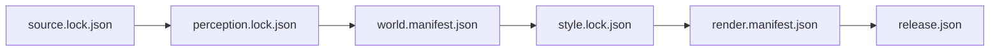

# Isometric Stanford architecture

This document records implemented truth. Planned production behavior remains in
GitHub issues and mdBook design chapters until code makes it current.

## Implemented bootstrap

The Rust workspace contains eight safe-Rust crates with a one-way dependency
graph. `isometric-source` validates the approved source lock and synchronizes
content-addressed artifacts through a bounded-memory cache. `isometric-core`
owns validated IDs, integer world coordinates, fixed
screen coordinates, and palette indexes. `isometric-world` owns an immutable,
spatially partitioned polygonal world with holes, building parts, heights,
roofs, materials, confidence, provenance, reviewed overrides, fixed
EPSG:26910 origin, and conservative screen bounds. Its class enum intentionally
has no transient people or vehicle variants. `isometric-style` owns the bounded
indexed palette, projection scales, and versioned ordinary-scene grammar.
`isometric-render` owns the deterministic CPU reference projection, procedural
grammar, and bounded fixed-point triangle and integer-depth raster core.
`isometric-publish` owns lossless WebP encoding, canonical indexed pyramid
tiles, complete artifact validation, and atomic DZI assembly.
`isometric-validate` owns fail-closed semantic and style checks.
`isometric-cli` exposes the complete planned command names, verifies and
compiles the vector hero world, executes reference rendering and validation,
and rejects unfinished commands.

```mermaid
flowchart LR
    source["isometric-source\napproved content cache"]
    perception["Pinned perception artifacts"]
    world["isometric-world\nimmutable semantic objects"]
    style["isometric-style\noriginal procedural rules"]
    render["isometric-render\nfixed-point CPU"]
    validate["isometric-validate\nfail-closed gates"]
    publish["isometric-publish\nlossless WebP DZI"]
    web["OpenSeadragon viewer shell"]

    source -. "future semantic extraction" .-> perception
    source -->|"locked OSM + Overture"| world
    perception -. "future fusion" .-> world
    world --> render
    style --> render
    world --> validate
    style --> validate
    render -->|"guarded indexed tiles"| publish
    publish -->|"static candidate"| web
```

The original reference grammar still renders world-anchored diamonds and
columns. The production raster core now accepts one canonical triangle batch,
sorts it by stable primitive key, clips work to the bounded viewport, applies a
half-open shared-edge rule at fixed pixel centers, interpolates integer depth,
and writes palette indices only when depth is closer. Equal-depth fragments
retain the lower stable key without an owner buffer. Each active raster surface
owns exactly one palette byte and one 32-bit depth value per pixel.

The ordinary scene compiler converts every canonical polygon and hole into
deterministic horizontal trapezoids, then triangles. It renders ground,
hardscape, roads, paths, empty parking, athletic surfaces, water, mapped
vegetation footprints, and ordinary building extrusions. A world-anchored grid
places stable, jittered, faceted tree crowns only inside mapped vegetation.
Buildings and crowns cast a separate hard-shadow mask that is composited onto
eligible surfaces. A bounded post-process adds sparse world-anchored material
patterns and one-pixel building and canopy outlines. Flat roof faces and two
directional facade ramps complete the ordinary-scene layer. A separate
landmark module replaces three source extrusions with original parameterized
geometry: a stepped and windowed Hoover Tower, a gabled Memorial Church with
repeated openings, and a reviewed low Main Quad mass with repeated courtyard
arcade openings.

The renderer derives a stable full-scene coordinate layout without allocating
its framebuffer. Each canonical tile selects objects through conservative
projected bounds, renders into a style-derived guard, applies every ordinary
and landmark pass in world coordinates, then crops its saved pixels. The seam
oracle reconstructs the full hero from independently rendered tiles and
requires byte equality with the monolithic reference. The 250 millimeter scale
probe renders the approximately 8K layout through the same bounded API. The
publisher encodes each palette tile as lossless RGB WebP, derives lower levels
from canonical indexed parents, records a complete hash chain, and atomically
promotes the staged pyramid. Survey-derived roof geometry and the qualified art
style remain unfinished layers.

The CLI currently implements `source sync`, `world compile`, `world inspect`,
`validate semantic`, `validate render`, `validate release`, `render region`,
`publish dzi`, `style candidate-a`, `style candidate-b`, and `style
candidate-c`. Source
synchronization rejects unapproved, mis-hashed, insecure, or Google-derived
records before use. Hero compilation projects WGS84 vector geometry into
EPSG:26910, subtracts the fixed origin, rounds to local integer millimeters,
derives stable content IDs, normalizes buildings and buffered road segments,
and records uncovered 20 meter cells as explicit unknowns. DZI publication
requires the compiled world, writes only to a new output path, and validates
every descriptor, canonical tile, WebP tile, palette color, and manifest hash.
The style command reconstructs the 7,623 by 3,325 indexed master from bounded
guarded tiles, crops four stable review scenes, renders isolated landmark masks,
and writes lossless WebP, HTML, metrics, and known deviations through an atomic
staging directory. The review assembly holds one 25 MB indexed master for
contact-sheet work; canonical tile workers remain bounded independently of map
area. All other documented command names fail with an explicit not-implemented
error.

`publish dzi` keeps the locked base style as its default and accepts the
explicit selector `candidate-c` for inspectable, unapproved preview pyramids.
Every generated release manifest records the exact style ID and style-file
digest. Release validation fails closed unless both the palette bytes and style
identity match a known implementation. Scheduled assurance, the release dry
run, and the real-pyramid browser suite use Candidate C explicitly without
changing `style.lock.json` or representing the candidate as approved.

Candidate B extends the ordinary grammar without changing the raster boundary.
Eligible walls receive repeated depth-safe window and door quads. Convex simple
footprints receive bounded hip-roof planes, while complex footprints fail back
to the deterministic flat fill. Each object is capped at 512 facade quads and
32 hip-roof planes before fallback. Parking markings and material variation are
anchored in absolute projected coordinates. Four-tone tree crowns remain
seeded by stable object IDs. Conservative roof bounds participate in spatial
tile selection, and Candidate B guarded tiles must reconstruct the monolithic
scene exactly.

Candidate C is the final bounded style stage on the same raster architecture.
It adds diagonal roof-tile accents in absolute projected coordinates so both
hip and complex planar roofs receive seamless treatment. Stable object IDs
select facade omissions, glazing tones, lintels, and door positions without
runtime randomness. Hero openings use the Candidate C material ramp, while
road and path accents use sparse world-anchored dash cadence. The monotonic
detail-level enum prevents incompatible boolean combinations and keeps earlier
candidate constructors byte-stable.

The vector world currently contains 2,820 objects in 72 partitions. Its
387,096 ppm unknown-cell result is expected because NAIP land cover and LiDAR
terrain and canopy have not been compiled. The manifest names those five
deferred inputs explicitly. OSM construction features are omitted, and neither
the schema nor the compiler can emit people or vehicles.

The web workspace implements a responsive, accessible viewer shell. It creates
an OpenSeadragon instance only when a DZI URL is configured, keeps browser
image smoothing disabled, bounds decoded-tile counts from an explicit memory
policy, starts phone-width screens at a legible zoom, and reports missing
release configuration. The viewer uses the Canvas drawer, keeps keyboard and
touch navigation enabled, retries failed tiles twice, exposes recoverable
descriptor and tile failures, and redraws after a context restoration event.
Ordinary CI exercises a routed lossless DZI fixture on desktop and mobile;
scheduled assurance repeats the same checks against the complete generated
Candidate C hero pyramid. A locally generated candidate has been exercised in the viewer,
but no DZI release is committed or published.

## Binding invariants

1. World coordinates are signed integer millimeters relative to a versioned
   local origin. Canonical rasterization does not depend on floating point.
2. Object ID zero is reserved. Objects are rendered in stable ID order until a
   depth-sorted production scene contract replaces this bootstrap order.
3. Polygon rings are bounded, closed, nonzero-area, and non-self-intersecting.
   Holes and multipolygon components may not cross or overlap.
4. Style palettes contain 1 to 128 colors. Every saved pixel is a palette
   index before encoding.
5. Reference-output dimensions are non-zero and at most 16,384 pixels per
   image. Production raster surfaces are capped at 4,096 pixels per side.
6. Projection arithmetic checks overflow and fails without partial output.
7. Final renderable semantic types cannot express people or vehicles.
8. Unknown semantic objects fail qualification instead of becoming invented
   geometry.
9. External artifacts are content-addressed and referenced through manifests,
   never silently vendored into Git.
10. Canonical exact hashes are Linux CPU evidence. Cross-platform comparisons
   use semantic IDs and approved palette-index tolerances.
11. Release promotion is unavailable until source, perception, world, style,
    render, and release manifests form a complete verified chain.

## Durable artifact chain



The source and world manifests now form the first verified production segment
of the artifact chain. The world manifest pins both vector source hashes and
the canonical generated world hash. The manifest validator rejects malformed
hashes, mismatched source inputs, unaccounted deferred inputs, wrong bounds,
unknown schemas, and a release marked published before qualification.

## Not implemented

- Object storage and resumable remote acquisition
- NAIP or LiDAR semantic ingestion
- Perception model execution and correction workflow
- Raster evidence fusion, dirty-region propagation, and qualification-level
  unknown resolution
- Detailed ridge, tile, and complex-footprint roof grammar
- Review dashboard, full visual metrics, and fixed-device qualification
- H100 perception benchmark and full vertical-slice render

Those boundaries are tracked as GitHub Research, Decision, Requirement, and
Task issues. Documentation may explain the intended design but must not claim
it is implemented.
